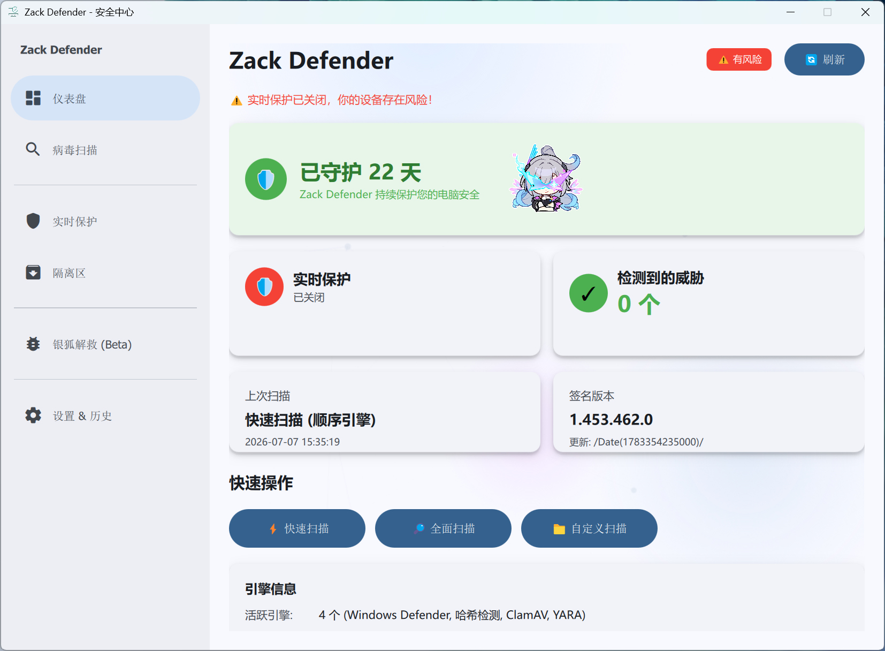
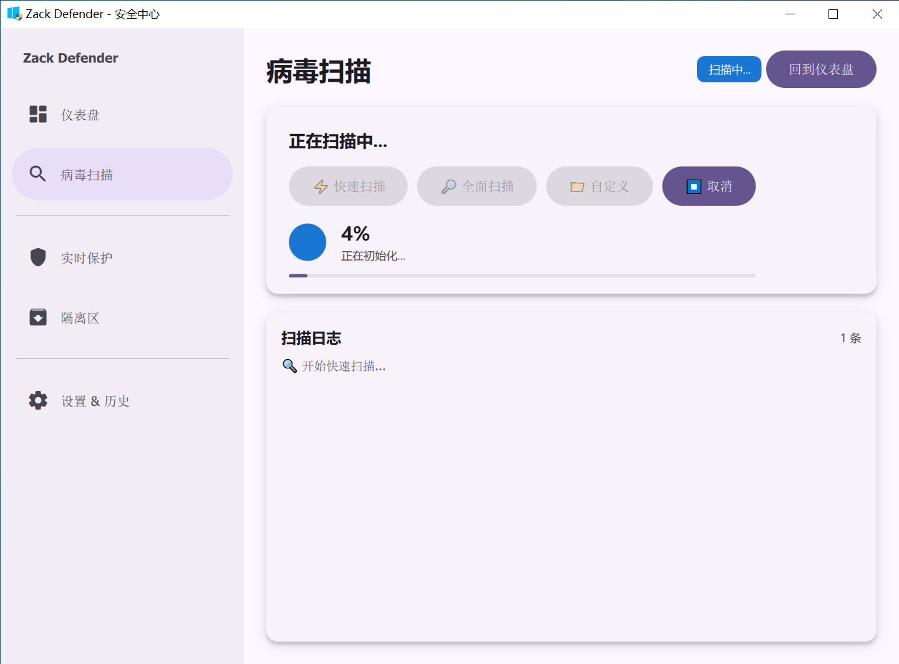
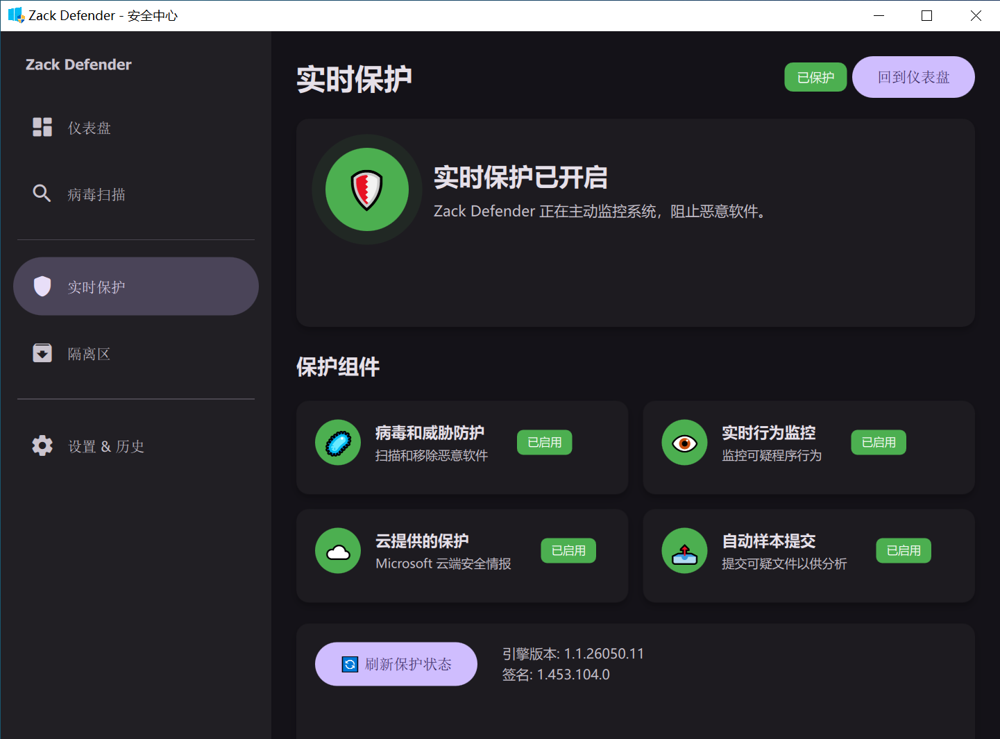
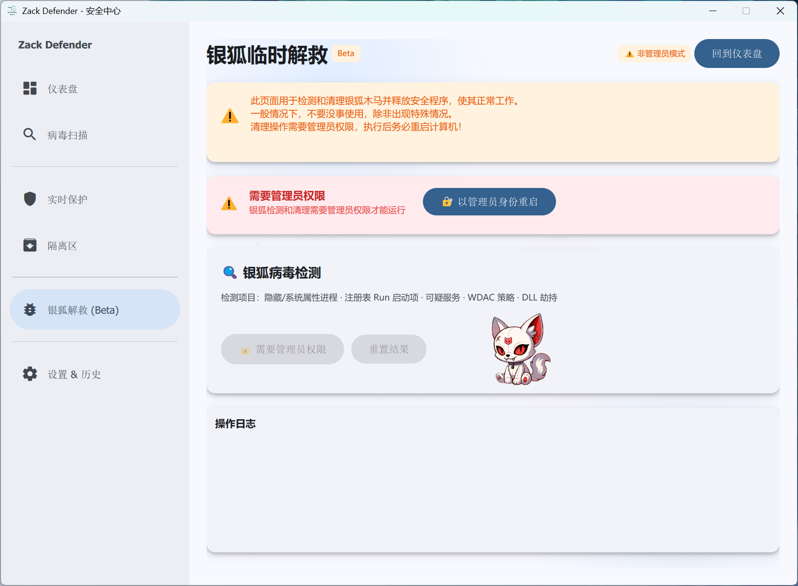

# 🛡 Zack Defender

<p align="center">
  
</p>

<p align="center">
  <b>现代化 Windows 安全中心 · 四引擎本地查杀</b><br>
  Material Design 3 界面 | 轻量 · 高效 · 开源 · 本土化
</p>

<p align="center">
  
  
  
  
  
</p>

<p align="center">
  <a href="README.md">EN English</a> | <a href="README_zh-CN.md">简体中文</a>
</p>

---

## ✨ 功能特性

| 功能 | 说明 |
|------|------|
| 🛡 **四引擎查杀** | Hash 哈希 → ClamAV → YARA 规则 → Windows Defender，四层递进扫描，不漏过任何一个威胁 |
| 🔍 **多种扫描模式** | 快速扫描（7个关键目录）、全盘扫描、自定义文件夹扫描、右键菜单扫描 |
| 🦊 **银狐病毒专杀** | 针对国内流行的银狐木马变种专项检测，覆盖已知家族特征 |
| 📊 **实时监控** | 展示防护状态、病毒库版本、引擎信息等实时数据 |
| 📋 **全局威胁历史** | 跨页面持久化威胁记录，扫描结果与系统历史统一管理 |
| 📦 **隔离区管理** | 查看和管理隔离文件 — 支持还原或永久删除 |
| 🔔 **通知系统** | MD3 风格应用内提示 + 系统托盘 Windows 气泡通知 |
| 📌 **系统托盘** | 最小化到托盘，右键菜单快速扫描，守护始终在线 |
| 🎨 **主题切换** | 跟随系统 / 浅色 / 深色模式 — 自动适配 Windows 主题或手动选择 |
| 🎭 **吉祥物系统** | 呆萌小狐狸全程陪伴，扫描焦虑一扫而空 |
| 📋 **更新日志** | 版本更新后首次运行自动弹出，也可从设置页面再次查看 |
| 🔒 **单例运行** | 只允许一个实例运行，重复启动时会友好提示 |
| 📦 **MSIX 安装包** | 现代化安装体验，支持自动更新和干净卸载 |
| 🖼 **右键集成** | 在文件资源管理器中右键直接扫描文件或文件夹 |

## 📸 截图预览

| 仪表板 | 扫描界面 | 深色主题 | 银狐查杀 |
|:---:|:---:|:---:|:---:|
|  |  |  |  |

## 🚀 安装指南

从 [Releases](https://github.com/Jerry9335/ZackDefender/releases) 下载最新安装包：

| 文件 | 格式 | 说明 |
|------|------|------|
| `Zack-Defender-v1.9.0.zip` | ZIP | 推荐 — 现代化安装体验，Win10 21H2+ |

系统要求：

- **Windows 10** 21H2 (build 19044) 或更高版本 / **Windows 11**
- Windows Defender 建议保持启用（四引擎中的第四层）
- ClamAV 和 YARA 引擎已内置，无需额外安装

## 🛠 技术栈

| 层次 | 技术 |
|------|------|
| **UI 框架** | Qt 6.11 + QML |
| **设计系统** | Material Design 3 (MD3) |
| **编程语言** | C++17 |
| **构建系统** | CMake + Ninja |
| **编译器** | MinGW 13.1 (GCC) |
| **打包格式** | MSIX / 便携 ZIP |

**四引擎扫描架构** — 顺序执行，逐层递进：

```
EngineManager (引擎调度中心)
    │
    ├── HashEngine     → SHA-256 哈希黑名单匹配（最快）
    ├── ClamAVEngine   → 开源病毒库签名扫描（191MB+ 病毒库）
    ├── YaraEngine     → 自研 YARA 规则匹配（银狐/勒索/挖矿）
    └── DefenderEngine → Windows Defender 命令行接口（系统兜底）
```

**15 个异步 C++ 后端** — 绝不阻塞 UI 线程：

```
EngineManager       → 四引擎调度中心，统一管理扫描流水线
HashEngine          → SHA-256 哈希黑名单快速匹配
ClamAVEngine        → ClamAV 开源引擎封装
YaraEngine          → YARA 规则引擎（含银狐专项规则）
DefenderEngine      → Windows Defender MpCmdRun 封装
SilverFoxEngine     → 银狐病毒专项检测模块
DefenderScanner     → 通用扫描后端（路径遍历、进度统计）
ProtectionMonitor   → 实时防护状态（WMI + PowerShell）
ThreatHistory       → 全局威胁历史记录（QSettings 持久化）
QuarantineManager   → 本地 + Defender 隔离区管理
TrayManager         → 系统托盘图标及通知
ThemeManager        → 深色/浅色/跟随系统主题
UpdateManager       → 版本更新日志提醒
ContextMenuManager  → 右键菜单注册与调用
VirusTotalEngine    → VirusTotal 在线查询（辅助参考）
```

## 🔧 从源码构建

### 前置条件

- Qt 6.11+ (mingw_64 套件)
- MinGW 13.1+ (Qt 自带)
- CMake 3.16+
- Material Components QML

### 构建步骤

```bash
# 设置环境变量（请根据实际安装路径修改）
export PATH="/d/Qt/Tools/CMake_64/bin:/d/Qt/Tools/Ninja:/d/Qt/Tools/mingw1310_64/bin:/d/Qt/6.11.1/mingw_64/bin:$PATH"

# 配置并编译
cd ZackDefender
cmake -S . -B build -G Ninja -DCMAKE_BUILD_TYPE=Release -DCMAKE_PREFIX_PATH="/d/Qt/6.11.1/mingw_64"
cmake --build build --target appzackdefender

# 运行
./build/appzackdefender.exe
```

## 📁 项目结构

```
md3-guardian/
├── src/
│   ├── main.cpp                  # 程序入口 + 单例锁
│   ├── resources.qrc              # Qt 资源文件
│   ├── backend/                   # C++ 后端（15个类）
│   │   ├── EngineManager.cpp      # 四引擎调度中心
│   │   ├── HashEngine.cpp         # 哈希黑名单引擎
│   │   ├── ClamAVEngine.cpp       # ClamAV 引擎
│   │   ├── YaraEngine.cpp         # YARA 规则引擎
│   │   ├── DefenderEngine.cpp     # Defender 引擎
│   │   ├── SilverFoxEngine.cpp    # 银狐专项检测
│   │   ├── VirusTotalEngine.cpp   # VirusTotal 查询
│   │   ├── DefenderScanner.cpp    # 通用扫描后端
│   │   ├── ProtectionMonitor.cpp  # 实时防护监控
│   │   ├── ThreatHistory.cpp      # 全局威胁历史
│   │   ├── QuarantineManager.cpp  # 隔离区管理
│   │   ├── TrayManager.cpp        # 系统托盘
│   │   ├── ThemeManager.cpp       # 主题管理
│   │   ├── UpdateManager.cpp      # 更新日志
│   │   └── ContextMenuManager.cpp # 右键菜单
│   ├── qml/
│   │   ├── Main.qml               # 主窗口 + 全局组件
│   │   └── pages/
│   │       ├── DashboardPage.qml  # 仪表板首页
│   │       ├── ScanPage.qml       # 扫描中心
│   │       ├── ProtectionPage.qml # 防护状态
│   │       ├── QuarantinePage.qml # 隔离区
│   │       ├── SilverFoxPage.qml  # 银狐专杀
│   │       └── SettingsPage.qml   # 设置
│   └── assets/                    # 图标 + 吉祥物资源
├── CMakeLists.txt                 # CMake 配置
├── deploy/                        # 引擎部署文件
│   ├── engines/
│   │   ├── clamav/                # ClamAV 病毒库 (~191MB)
│   │   └── yara/                  # YARA 规则库
│   └── ...
└── qtquickcontrols2.conf          # 字体配置（微软雅黑）
```

## 📋 版本历史

| 版本 | 日期 | 重大变更 |
|------|------|----------|
| **v1.9.0** | 2026-07 | 🎨 视觉焕新 & 体验升级：Qt 6.11 构建、MSIX 打包、吉祥物系统、全局 ThreatHistory、emoji 生机化 |
| v1.8.0 | 内部 | 🏗 界面重构（内部版本，未正式发布） |
| v1.7.0 | 内部 | 🔧 引擎替换：弃用 VirusTotal 在线，改用 ClamAV + YARA 本地引擎 |
| v1.6.0 | 内部 | 🦊 银狐病毒专杀模块上线 |
| v1.5.0 | 内部 | 🎨 扫描重构 & UI 升级 |
| v1.2.0 | 2026-06 | 🌐 初始公开发布：Windows Defender 单引擎 |

## 📄 许可证

本项目基于 [MIT 许可证](docs/EULA.txt) 发布。

第三方组件：
- [Qt Framework](https://www.qt.io/) — LGPL v3 / GPL v3
- [Material Components QML](https://github.com/sudoevolve/material-components-qml) — LGPL v3
- [ClamAV](https://www.clamav.net/) — GPL v2
- [YARA](https://virustotal.github.io/yara/) — BSD 3-Clause
